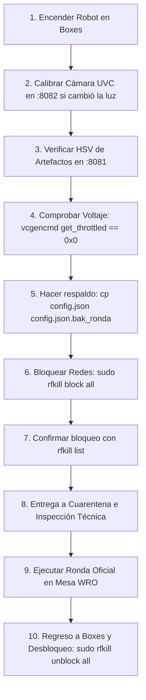

# Manual de Guía Rápida: Comandos de la Raspberry Pi y Operación WRO RoboMission Junior 2026

**Equipo:** Colegio Los Cedros — WRO RoboMission Junior 2026 (*Heritage Heroes*)  
**Plataforma:** Raspberry Pi 3B (Debian 13 arm64) + Makeblock MegaPi (ATmega2560)  
**Última actualización:** Temporada 2026

---

## 📑 Tabla de Contenidos

1. [Ficha Técnica y Conectividad](#1-ficha-técnica-y-conectividad)
2. [Comandos de Control desde la PC de Desarrollo](#2-comandos-de-control-desde-la-pc-de-desarrollo)
3. [Comandos en la Raspberry Pi (SSH / Consola)](#3-comandos-en-la-raspberry-pi-ssh--consola)
4. [Herramientas Web de Calibración en Vivo](#4-herramientas-web-de-calibración-en-vivo)
5. [Protocolo de Comunicación Serial (MegaPi ↔ Raspberry Pi)](#5-protocolo-de-comunicación-serial-megapi--raspberry-pi)
6. [Comandos Críticos para el Día de la Competencia](#6-comandos-críticos-para-el-día-de-la-competencia)
7. [Checklist Operativo de Competencia (Flujo en Boxes y Mesa Oficial)](#7-checklist-operativo-de-competencia)

---

## 1. Ficha Técnica y Conectividad

### 🔌 Parámetros de Red y Enlace

| Parámetro | Valor |
|---|---|
| **Hostname / Alias SSH** | `robot-pi` (también responde por `clc-wro-rm.local` y `192.168.0.166`) |
| **Usuario** | `pi` |
| **Autenticación SSH** | Clave privada `~/.ssh/id_robot_ed25519` (configurada en `~/.ssh/config`, sin clave interactiva) |
| **Permisos de Administrador** | `sudo` sin contraseña (`NOPASSWD`) habilitado en la Pi |
| **Directorio raíz del proyecto** | `/home/pi/WRO-RM-2026` |
| **Directorio de visión** | `/home/pi/WRO-RM-2026/vision` |
| **Cámara USB (UVC)** | `/dev/video0` (USB Camera 320x240 @ 20 fps reales) |
| **Controlador MegaPi** | `/dev/ttyUSB0` (115200 baudios, 8N1) |

### 🌐 Puertos Web y Servicios Expuestos

| Puerto | Herramienta | URL Local / Navegador | Función |
|---|---|---|---|
| **8080** | `vision_server.py` | `http://robot-pi:8080/` | Dashboard en vivo, streaming MJPEG y telemetría JSON |
| **8081** | `calibrar_web.py` | `http://robot-pi:8081/` | Calibrador HSV de artefactos 3D y centro de garra (`cx_garra`) |
| **8082** | `calibrar_camara.py` | `http://robot-pi:8082/` | Calibrador de controles UVC (exposición manual, ganancia, balance de blancos) |
| **8083** | `calibrar_destinos.py` | `http://robot-pi:8083/` | Calibrador HSV de cuadros planos del museo y marcos blancos |
| **8084** | `calibrar_torres.py` | `http://robot-pi:8084/` | Calibrador de torres de recolección (corona abierta) y destino (tapa negra) |

---

## 2. Comandos de Control desde la PC de Desarrollo

Ejecutar en la terminal de la PC (PowerShell, Git Bash o CMD) desde la raíz del proyecto `WRO-RM-2026`:

### 🔄 Sincronización Bidireccional y Diagnóstico (`herramientas/sync_pi.py`)

```bash
# 1. Enviar cambios locales de vision/ a la Pi y reiniciar automáticamente wro-vision.service
python herramientas/sync_pi.py push

# 2. Descargar la configuración calibrada (config.json) y los logs de la Pi a la PC
python herramientas/sync_pi.py pull

# 3. Consultar el estado del servicio wro-vision, /dev/video0 y /dev/ttyUSB0
python herramientas/sync_pi.py status

# 4. Ver en vivo las últimas 50 líneas de log del servicio en la Raspberry Pi
python herramientas/sync_pi.py logs -n 50

# 5. Reiniciar el servicio de visión en la Pi remotamente
python herramientas/sync_pi.py restart

# 6. Ejecutar las pruebas unitarias de visión directamente en la Raspberry
python herramientas/sync_pi.py test
```

### 🎥 Grabación Coordinada de Pruebas en Pista (`herramientas/grabar_sesion.py`)

Graba de forma sincronizada:
1. Cámara Externa (MSI StarCam 370i u otra webcam de mesa a 640x480).
2. Cámara Onboard del robot (stream MJPEG con overlay de detección).
3. Telemetría en JSONL (eventos de visión y trazas `#` de la MegaPi).

```bash
# Grabar una corrida de 30 segundos con nombre descriptivo
python herramientas/grabar_sesion.py -d 30 -n prueba_slot1

# Grabar corrida completa en modo interactivo (presionar ENTER para finalizar la grabación al detenerse el robot)
python herramientas/grabar_sesion.py -n corrida_oficial_01

# Grabar únicamente el stream del robot (sin cámara externa conectada a la PC)
python herramientas/grabar_sesion.py --solo-robot -d 20

# Grabar únicamente la cámara externa de la mesa
python herramientas/grabar_sesion.py --solo-externa -d 20

# Grabar sin generar el video compuesto inmediatamente (útil para no demorar entre pruebas rápidas)
python herramientas/grabar_sesion.py -d 25 --no-analisis
```

### 📊 Análisis Side-by-Side y Evaluación Offline (`herramientas/analizar_sesion.py`)

```bash
# Analizar y generar video compuesto Side-by-Side de la última corrida grabada
python herramientas/analizar_sesion.py --ultima

# Analizar una carpeta de sesión específica
python herramientas/analizar_sesion.py --sesion sesiones/sesion_20260901_015047_prueba_test

# Evaluar algoritmos de visión sobre un video grabado previamente (sin encender el robot ni la Pi)
python herramientas/evaluar_vision.py sesiones/sesion_20260901_015047_prueba_test/camara_robot.mp4 --modo FILA
```

---

## 3. Comandos en la Raspberry Pi (SSH / Consola)

Para ingresar por consola segura a la Raspberry Pi:
```bash
ssh robot-pi
# O directamente por dirección IP:
ssh pi@192.168.0.166
```

### ⚙️ Control del Servicio Systemd (`wro-vision.service`)

El servicio ejecuta `vision_server.py` automáticamente al arrancar la Pi.

```bash
# Ver estado del servicio (activo, PID, consumo de memoria y últimas líneas)
sudo systemctl status wro-vision

# Reiniciar el servicio (tras modificar config.json manualmente)
sudo systemctl restart wro-vision

# Detener el servicio (requerido si vas a correr vision_server.py o pruebas a mano)
sudo systemctl stop wro-vision

# Iniciar el servicio
sudo systemctl start wro-vision

# Monitorear logs del servicio en tiempo real (seguimiento continuo con -f)
journalctl -u wro-vision -f

# Ver las últimas 100 líneas del log del servicio sin paginación
journalctl -u wro-vision -n 100 --no-pager

# Habilitar autoarranque en el inicio del sistema
sudo systemctl enable wro-vision

# Deshabilitar autoarranque
sudo systemctl disable wro-vision
```

---

### 👁️ Ejecución Manual de `vision_server.py`

Ubicarse en la carpeta: `cd /home/pi/WRO-RM-2026/vision`

```bash
# 1. Modo producción (con enlace serie a la MegaPi y dashboard web en puerto 8080)
python3 vision_server.py

# 2. Modo prueba de mesa: sin MegaPi conectada (imprime las tramas 'T ...' en la consola)
python3 vision_server.py --sin-serial --web --color AUTO

# 3. Modo verboso con seguimiento inicial de un color específico
python3 vision_server.py --verbose --color VERDE

# 4. Especificar archivo de configuración alternativo y puerto web personalizado
python3 vision_server.py --config config_alternativo.json --puerto-web 8090
```

---

### 🧪 Pruebas Unitarias y Validación en la Pi

```bash
cd /home/pi/WRO-RM-2026/vision

# 1. Probar detector y lógica de decisión sin cámara (usa imágenes sintéticas)
python3 test_detector.py

# 2. Probar protocolo serial completo usando puertos virtuales PTY
python3 test_protocolo.py

# 3. Verificar que no haya errores de sintaxis en los scripts Python
python3 -m py_compile vision_core.py vision_server.py calibrar_web.py calibrar_camara.py
```

---

### 🌐 Consultas Rápidas por Terminal a la API de Visión (CURL)

Cuando `vision_server.py` o el servicio están corriendo:

```bash
# Ver estado actual del servidor (FPS, modo, si serial está conectado)
curl -s http://localhost:8080/estado | jq .

# Ver eventos de telemetría recientes
curl -s http://localhost:8080/telemetria | tail -n 15

# Reiniciar el buffer de telemetría para una nueva corrida
curl -s http://localhost:8080/telemetria/reset
```

---

## 4. Herramientas Web de Calibración en Vivo

> **Gestor de Exclusividad de Cámara:** Todos los scripts de calibración implementan `GestorExclusividadCamara`. Al ejecutarse, **pausan temporalmente el servicio `wro-vision`** para tomar control exclusivo de `/dev/video0`, y lo reanudan automáticamente al cerrarse con `Ctrl+C`.

### 1️⃣ Calibrador de Cámara UVC (`calibrar_camara.py`)
* **Propósito:** Ajustar iluminación, exposición manual (para evitar desenfoque por movimiento), balance de blancos y ganancia antes de calibrar colores.
* **Puerto:** `8082`
* **Comando:**
  ```bash
  cd /home/pi/WRO-RM-2026/vision
  python3 calibrar_camara.py --puerto 8082
  ```
* **Uso:** Abrir `http://robot-pi:8082`. Presionar **Auto-Medir y Fijar** para que la cámara mida la luz ambiental de la pista y fije exposición y balance de blancos en manual. Luego presionar **Guardar en config.json**.

---

### 2️⃣ Calibrador HSV de Artefactos 3D (`calibrar_web.py`)
* **Propósito:** Ajustar rangos HSV de los objetos 3D (`ROJO`, `VERDE`, `AZUL`, `AMARILLO`, `NEGRO`), centro de garra (`cx_garra`) y tabla de distancias `ey -> mm`.
* **Puerto:** `8081`
* **Comando:**
  ```bash
  cd /home/pi/WRO-RM-2026/vision
  python3 calibrar_web.py --puerto 8081
  ```
* **Uso:** Abrir `http://robot-pi:8081`. Seleccionar el color deseado, ajustar los deslizadores de H, S y V. Verificar que los dedos azules de la garra queden enmascarados en las `zonas_ignoradas`.

---

### 3️⃣ Calibrador de Destinos del Museo (`calibrar_destinos.py`)
* **Propósito:** Calibrar los cuadros planos impresos en la pista (área del museo) sin alterar la calibración de los artefactos 3D.
* **Puerto:** `8083`
* **Comando:**
  ```bash
  cd /home/pi/WRO-RM-2026/vision
  python3 calibrar_destinos.py --puerto 8083
  ```
* **Uso:** Abrir `http://robot-pi:8083`. Ajusta la región de interés (ROI vertical) y la detección del marco blanco exterior que rodea al cuadro.

---

### 4️⃣ Calibrador de Torres (`calibrar_torres.py`)
* **Propósito:** Calibrar la distinción entre Torres a Recolectar (cuerpo amarillo + corona abierta blanca) y Torres de Destino (cuerpo amarillo + tapa cerrada negra).
* **Puerto:** `8084`
* **Comando:**
  ```bash
  cd /home/pi/WRO-RM-2026/vision
  python3 calibrar_torres.py --puerto 8084
  ```
* **Uso:** Abrir `http://robot-pi:8084`. Modifica exclusivamente la sección `torres` de `config.json`.

---

## 5. Protocolo de Comunicación Serial (MegaPi ↔ Raspberry Pi)

* **Parámetros de enlace:** 115200 baudios, 8 bits de datos, sin paridad, 1 bit de parada (8N1).
* **Terminación de línea:** `\n`.

### 📤 MegaPi ➔ Raspberry Pi (Comandos)

| Comando | Acción |
|---|---|
| `C AUTO` | Identifica el artefacto centrado frente a la garra y fija el seguimiento |
| `C <COLOR>` | Sigue exclusivamente ese color (`ROJO`, `VERDE`, `AZUL`, `AMARILLO`, `NEGRO`) |
| `M PAUSA` | Detiene procesamiento visual intensivo; mantiene latido serial activo |
| `M ARTEFACTO <COLOR>` | Activa el detector de artefactos 3D para el color indicado |
| `M DESTINO <COLOR>` | Activa el detector de cuadros planos del museo con marco blanco |
| `M TORRE_REC` | Modo torre a recolectar (corona blanca superior abierta) |
| `M TORRE_DEST` | Modo torre de destino (tapa negra superior cerrada) |
| `M FILA` y luego `F` | Devuelve los colores de los cuatro artefactos ordenados de izquierda a derecha |
| `X` | Escaneo diagnóstico de los 5 colores en el cuadro actual |
| `S 0` / `S 1` | Pausa (`0`) o reanuda (`1`) el streaming continuo de tramas `T` |
| `P` | Ping (la Pi responde con versión de firmware y modos disponibles) |
| `# mensaje` | Mensaje de depuración emitido por la MegaPi (la Pi lo registra en telemetría sin procesarlo) |

### 📥 Raspberry Pi ➔ MegaPi (Trama periódica por cuadro)

```text
T <found> <color> <ex> <ey> <area> <dist> <fps> <confianza>
```

* **Ejemplo:** `T 1 VERDE -14 112 1840 160 22 92`

| Campo | Significado |
|---|---|
| `found` | `1` si hay un objetivo válido detectado; `0` si no hay detección |
| `color` | Color identificado o `NINGUNO` |
| `ex` | Error horizontal en píxeles respecto al centro de garra (`ex < 0`: girar a la izquierda; `ex > 0`: girar a la derecha) |
| `ey` | Fila inferior del contorno en píxeles (aumenta al aproximarse al objeto) |
| `area` | Área en píxeles del contorno detectado |
| `dist` | Distancia estimada al objeto en milímetros (según `tabla_distancia`) |
| `fps` | Frecuencia de cuadros por segundo de la cámara |
| `confianza` | Calidad de la forma geométrica (0 a 100) |

---

## 6. Comandos Críticos para el Día de la Competencia

### 🛑 A. Cumplimiento Reglamentario WRO (Desactivación de Redes Inalámbricas)

> **Regla WRO:** Durante la inspección técnica, tiempo de cuarentena y rondas oficiales está **estrictamente prohibida la comunicación inalámbrica**. La Raspberry Pi no debe emitir Wi-Fi ni Bluetooth.

```bash
# --- ANTES DE LA INSPECCIÓN Y ENTRAR A CUARENTENA ---
# 1. Bloquear Wi-Fi y Bluetooth por hardware/software:
sudo rfkill block wifi
sudo rfkill block bluetooth

# 2. Comprobar que ambas interfaces figuren como 'blocked: yes':
rfkill list

# --- AL FINALIZAR LA RONDA Y VOLVER A BOXES ---
# Reactivar interfaces para calibrar o descargar telemetría:
sudo rfkill unblock wifi
sudo rfkill unblock bluetooth
```

---

### 🔍 B. Diagnóstico Express de Hardware en Boxes (Checklist de 30 segundos)

Si el robot enciende pero no detecta objetos o la MegaPi no responde:

```bash
# 1. ¿La cámara USB está reconocida por el kernel de Linux?
v4l2-ctl --list-devices
# Debe listar: 'USB Camera ... /dev/video0'

# 2. ¿El convertidor USB-Serial de la MegaPi está conectado?
ls -la /dev/ttyUSB*
# Debe responder: /dev/ttyUSB0 con grupo dialout

# 3. ¿La cámara está bloqueada por un proceso muerto o colgado?
sudo fuser -v /dev/video0
# Si hay un PID fantasma bloqueando el dispositivo, forzar su cierre inmediato:
sudo fuser -k /dev/video0

# 4. Ver los últimos eventos de conexión/desconexión USB en el sistema:
dmesg | grep -E 'usb|tty' | tail -n 20
```

---

### ⚡ C. Salud Eléctrica y Temperatura (¡Vital en Raspberry Pi 3B!)

Una batería descargada o una mala conexión con el convertidor de 5 V / 2.5 A causa **caídas de tensión (Undervoltage)** que reducen la velocidad del procesador o reinician la Pi en mitad de la pista.

```bash
# 1. Consultar estado de subvoltaje y throttling:
vcgencmd get_throttled

# 2. Medir temperatura actual del procesador:
vcgencmd measure_temp
# Valor óptimo: < 65°C. Si supera los 80°C se producirá throttling térmico.

# 3. Medir voltaje del núcleo de la Pi:
vcgencmd measure_volts core
```

#### 📖 Decodificación de `vcgencmd get_throttled`:

| Valor Hexadecimal | Diagnóstico | Acción requerida |
|---|---|---|
| `throttled=0x0` | **Estado óptimo.** Alimentación y temperatura perfectas. | Ninguna. Listo para competir. |
| `throttled=0x50000` | Hubo subvoltaje en algún momento previo desde el encendido. | Revisar conectores de alimentación. |
| `throttled=0x50005` | **¡PELIGRO! Subvoltaje ACTIVO.** La CPU está operando frenada. | **Reemplazar o cargar la batería inmediatamente.** |
| `throttled=0x20000` | Hubo estrangulamiento térmico (sobrecalentamiento previo). | Permitir enfriamiento o mejorar disipación. |

---

### 💾 D. Respaldo y Restauración de Emergencia de la Configuración

Antes de realizar cambios de último minuto en los colores en boxes:

```bash
cd /home/pi/WRO-RM-2026/vision

# 1. Crear copia de respaldo con fecha y hora:
cp config.json config.json.bak_$(date +%H%M)

# 2. Listar respaldos existentes:
ls -lh config.json.bak_*

# 3. Restaurar respaldo previo si la nueva calibración falló:
cp config.json.bak_1030 config.json
sudo systemctl restart wro-vision
```

---

### 🛑 E. Apagado Seguro del Robot

> **ADVERTENCIA CRÍTICA:** **NUNCA** apagues el robot cortando el interruptor principal de la batería sin apagar la Raspberry Pi primero. Esto puede **corromper el sistema de archivos de la tarjeta microSD**, dejando el robot inoperativo antes de una ronda.

```bash
# Ordenar apagado seguro del sistema operativo:
sudo poweroff
# O alternativamente:
sudo shutdown -h now

# Esperar a que el LED verde (actividad microSD) deje de parpadear y se apague por completo
# (aproximadamente 5 a 10 segundos). Solo entonces apagar el interruptor físico de batería.
```

---

## 7. Checklist Operativo de Competencia

Sigue este procedimiento en cada una de las rondas oficiales:



| Paso | Acción | Comando / Verificación |
|---|---|---|
| **1** | Encender robot en boxes | Conectar batería y esperar 25 s a que suba el sistema. |
| **2** | Calibrar cámara UVC | Entrar a `http://robot-pi:8082`, usar **Auto-Medir y Fijar** y **Guardar**. |
| **3** | Calibrar colores HSV | Entrar a `http://robot-pi:8081` y verificar las máscaras sobre los objetos en la pista. |
| **4** | Comprobar salud eléctrica | `vcgencmd get_throttled` (debe arrojar `0x0`). Batería con carga > 80%. |
| **5** | Respaldar configuración | `cp config.json config.json.bak_rondaX` |
| **6** | Bloquear señales de radio | `sudo rfkill block wifi && sudo rfkill block bluetooth` |
| **7** | Inspección de radio | `rfkill list` (ambas deben decir `Soft blocked: yes`). |
| **8** | Cuarentena | Entregar robot a la mesa de jueces con interruptor listo. |
| **9** | Ronda Oficial | Iniciar con el pulsador de la MegaPi en la zona de salida. |
| **10** | Retorno a boxes | `sudo rfkill unblock wifi && sudo rfkill unblock bluetooth` para retomar análisis. |
